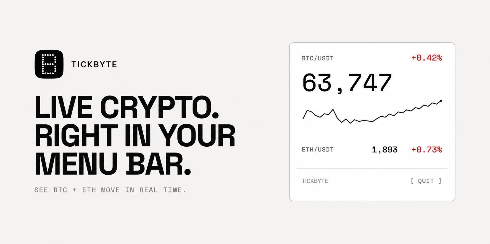

  
  <h1>Tickbyte</h1>
  
Live BTC and ETH prices in your Mac menu bar.

  

 

## Highlights

- Live Bitcoin and Ethereum prices directly in the macOS menu bar.
- A focused price panel with daily change and a UTC-day sparkline.
- Native, lightweight, and designed to stay out of your way.

## Requirements

- macOS 15.2 or later.
- An internet connection for live Binance market data.

## Privacy

Tickbyte is sandboxed and connects to Binance only for market data. It has no accounts, analytics, or third-party package dependencies.

## License

[MIT](LICENSE)
